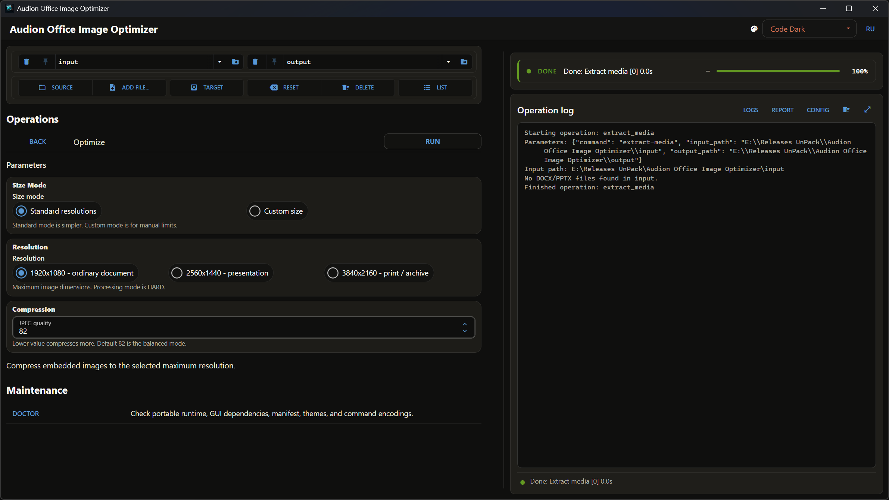

# Audion Office Image Optimizer

<!-- audion:release -->
<p align="center">
  <a href="https://audion.dev/downloads/office-image-optimizer"></a>
  <a href="https://github.com/Tensionix/office-image-optimizer/releases/latest"></a>
  <a href="https://github.com/Tensionix/office-image-optimizer/releases"></a>
  <a href="https://github.com/Tensionix/office-image-optimizer/blob/main/LICENSE"></a>
</p>

**Version 1.7.2** · 2026-09-04 · 103.8 MB

- [Direct download](https://audion.dev/get/office-image-optimizer/1.7.2/Audion_Office_Image_Optimizer_v1.7.2_Full.zip) — unmetered, no rate limits
- [Project page](https://audion.dev/downloads/office-image-optimizer) — every version and how to install

<p align="center"></p>

`SHA-256: 15de398ac21d9e5aad196717905bfa644ce2a1d12c532da7e56dac01263cfed7`

---

An **Audion** tool, published by [Tensionix](https://github.com/Tensionix).
<!-- /audion:release -->


[Русский](Docs/README_RU.md) · [User Guide](Docs/USER_GUIDE_EN.md)

**Contents**

- [Why It Exists](#why-it-exists)
- [Principles](#principles)
- [Next](#next)
- [Technical Reference](#technical-reference)
  - [Layout](#layout)
  - [Workbench Naming](#workbench-naming)

Processes raster images **inside** Word documents and PowerPoint presentations,
without taking the document apart.

## Why It Exists

A document with photographs weighs a hundred megabytes because every image inside
it is a phone picture at full resolution. It opens slowly, will not go by email,
and behaves unpredictably in print.

The usual approach is to extract the images, process them, and put them back. That
approach loses everything: position, text wrapping, captions, anchoring to the
paragraph.

This program works on the images **in place**: the document stays the same
document, and only what is inside the pictures changes.

## Principles

**The layout is untouched.** Position, size on the page, wrapping, anchoring — all
stay as they were. Pixels change, markup does not.

**The colour profile is chosen explicitly.** As in the other Audion programs: one
thing for screen, another for print, and a person decides which.

**The source is not modified.** The result is written separately.

## Next

* [User Guide](Docs/USER_GUIDE_EN.md) — step by step.

---

## Technical Reference

### Layout

```
system_core\app\   the code
runtime\           embedded Python
config\            defaults and colour profiles
```

### Workbench Naming

One shared vocabulary across all Audion projects: **Source**, **Add file…**,
**Target**, **Reset**, **Delete**, **List**.
